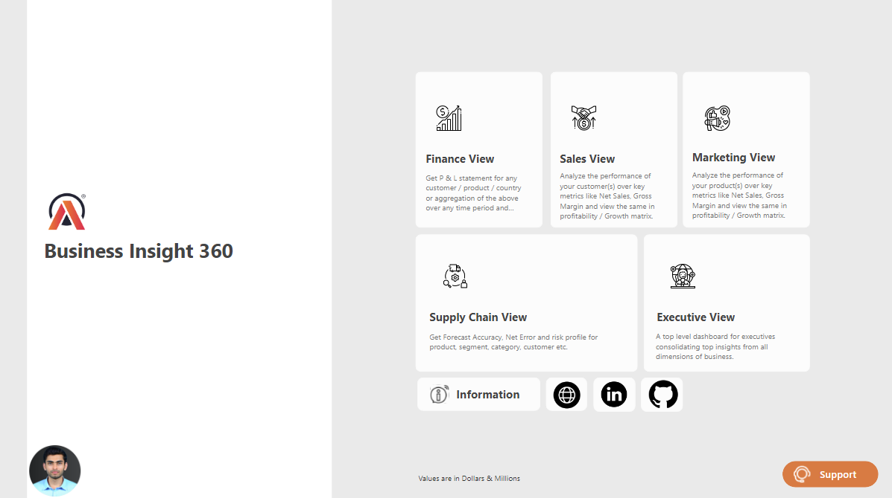
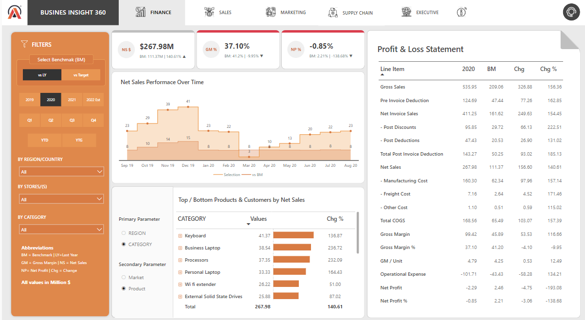
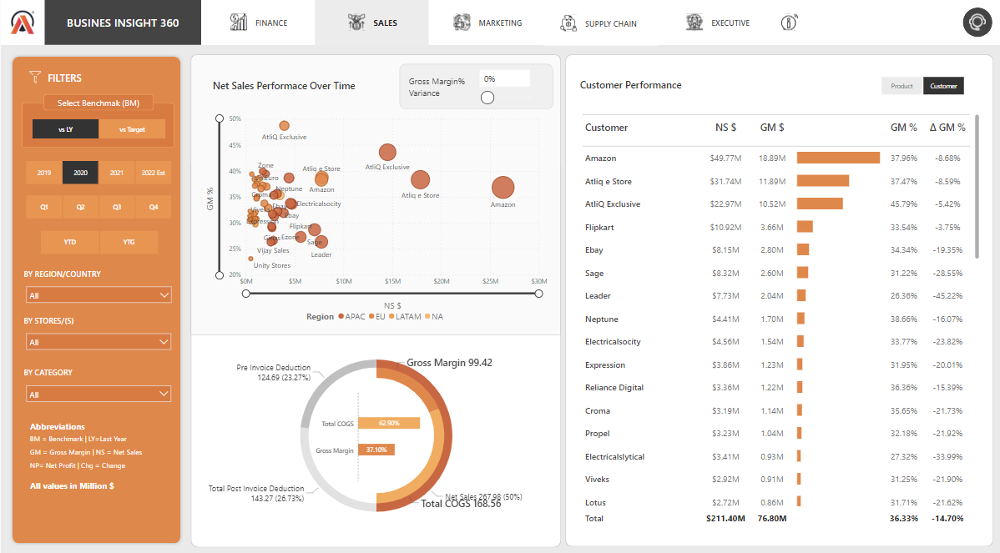
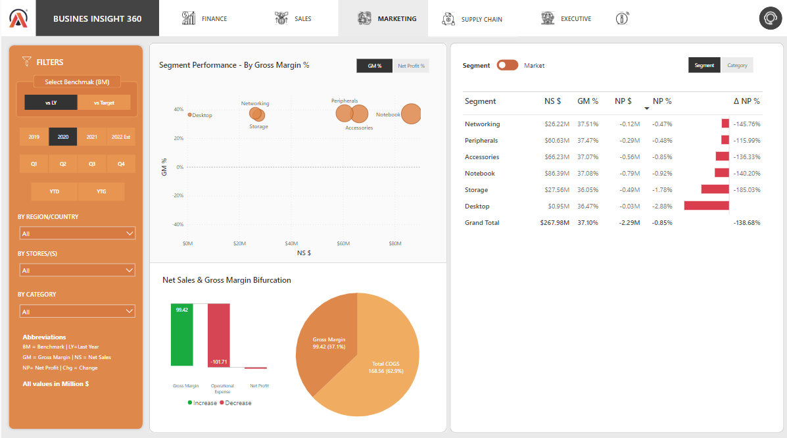
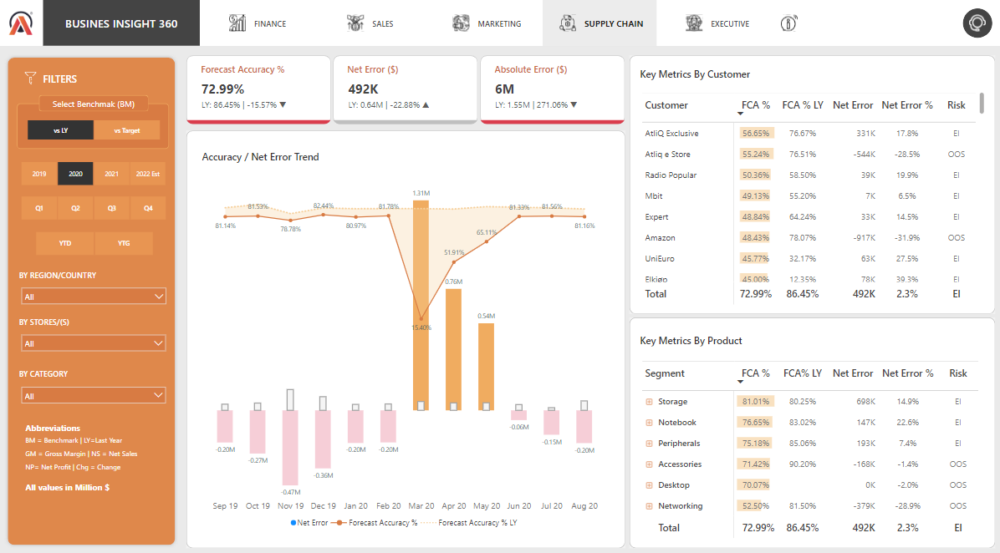
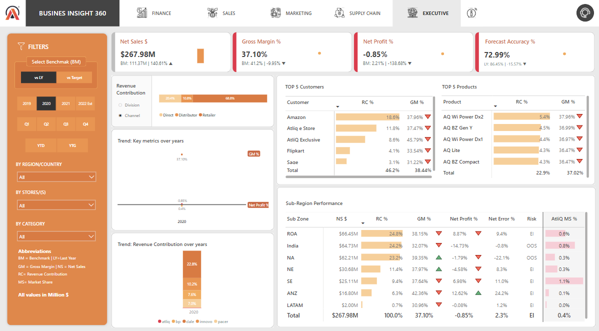

# Business Insight 360: Sales Insights for AtliQ Hardware

## Access Dashboard

Access the complete Power BI visualization [here](https://app.powerbi.com/view?r=eyJrIjoiNGE3ZjZkNjItNTFhOC00OGUzLTgwN2UtZjExYmVmMGZkYzhiIiwidCI6ImM2ZTU0OWIzLTVmNDUtNDAzMi1hYWU5LWQ0MjQ0ZGM1YjJjNCJ9&pageName=ReportSection9275feb00c2e013d8906)

## Problem Statement

AtliQ Hardware, a computer hardware and peripheral manufacturer with branches across India, is experiencing declining sales and struggling to understand its business performance. The sales director faces challenges in gathering and interpreting sales data efficiently. Regional managers find it cumbersome to extract insights from Excel files, leading to frustration and a lack of clarity regarding sales trends, customer preferences, stock management, and effective advertising strategies. To address these issues, AtliQ requires a solution to visualize sales patterns, enabling data-driven decision-making and business improvement.

## Data Analysis and Visualization using Power BI

- Utilized the provided SQL database dump to connect MySQL Database with Power BI Desktop.
- Loaded data into Power BI Desktop and transformed it using Power Query to ensure accuracy and consistency.
- Prepared data for analysis and visualization through meticulous cleaning and transformation within Power BI usig Power query.

## Building Dashboards or Reports

Utilized Power BI Desktop to create comprehensive dashboards and reports, including:

### Finance View: 
   
   -Profit and loss statement analysis by customer, product, or country over any time period.
     
### Sales View 
   
   -Performance analysis of customers based on key metrics like net sales and gross margin.
   
### Marketing View
   
   -Analysis of product performance in terms of net sales and gross margin.
   
### Supply Chain View 

Forecast accuracy, net error, and risk profile analysis for product segments and customers.
   
   
### Executive View
    
    Top-level dashboard consolidating insights across all dimensions of the business.

## Technologies and Tools Used

### Learning Stack:

- SQL
- PowerBI Desktop
- Excel
- DAX Language
- DAX Studio (for report optimization)

### Power BI Techniques:

- Creating calculated columns and measures using DAX language
- Data modeling
- Using Bookmarks for visualization switching
- Page navigation with buttons
- Dynamic titles based on applied filters
- KPI indicators and conditional formatting
- Data validation techniques
- Power BI Services and report publishing
- Setting up personal gateway for data auto-refresh

## Business Metrics Tracked

- Sales quantity
- Gross price
- Pre-invoice deductions
- Post-invoice deductions
- Net invoice sale
- Gross margin
- Net sales
- Net profit
- COGS (Cost of Goods Sold)
- YTD (Year to Date)
- YTG (Year to Go)
- Net error 
- Net error %
- Net error variance
- Forecast accuracy
- Forecast accuracy variance
- Absolute error
- Absolute error %
- Aboslute forecast accuracy

## About Power BI

Power BI is a business analytics tool by Microsoft that allows users to visualize and analyze data from various sources. It offers interactive dashboards and reports, providing insights into business performance and enabling data-driven decision-making.

## Power BI Documentation

For more information about Power BI and its features, refer to the [official documentation](https://docs.microsoft.com/en-us/power-bi/).

## Contact

If you have any queries or bugs to report, feel free to reach out to me on [LinkedIn](https://www.linkedin.com/in/pratheekpshenoy/).
